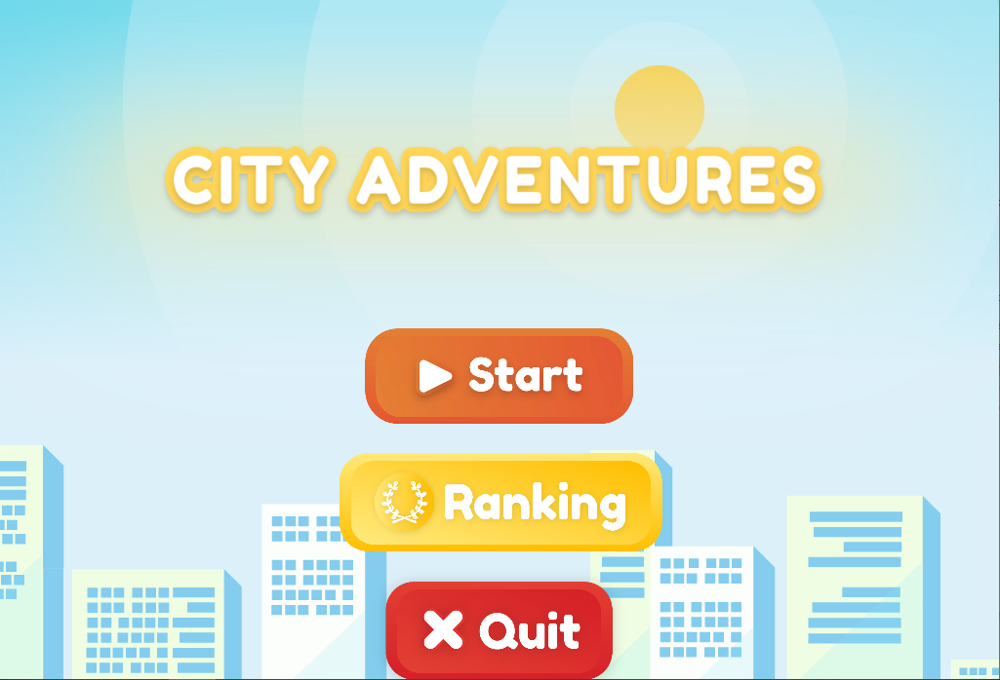
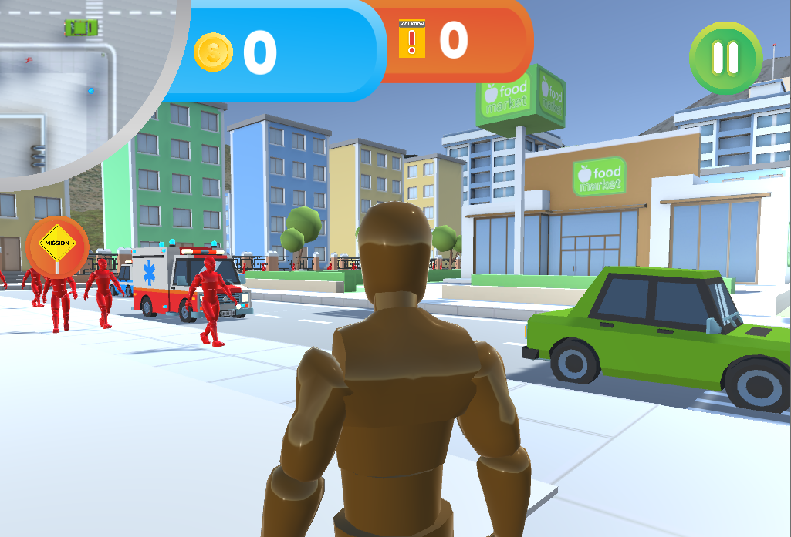

 

  

  <h3 align="center">City Adventures</h3>

<!-- ABOUT THE PROJECT -->
## About The Project

Embark on an exhilarating journey through City Adventures, the immersive 3D adventure game that blends excitement with real-world lessons. As you navigate the bustling city streets, your mission is to collect coins on your way to the ultimate destination. However, here's the twist: your score will be deducted if you fail to adhere to traffic rules and regulations. City Adventures not only provides thrilling gameplay but also instills valuable lessons in traffic safety and awareness. Choose from various player modes including walking, kickboard, bicycle, and car, each offering a unique perspective and travel experience within the vibrant city. With each step, pedal, or wheel, you'll learn the importance of observing traffic rules while immersed in an exciting virtual world. Are you ready to embark on this adventure, sharpen your skills, and become a responsible virtual citizen of City Adventures? The journey awaits!

### Built With

* [![Unity][Unity-logo]][Unity-url]

[Unity-logo]: https://img.shields.io/badge/Unity-20232A?style=for-the-badge&logo=react&logoColor=61DAFB
[Unity-url]: https://unity.com/

## Previews

  

  

## Download

Download Link: https://drive.google.com/file/d/1QKxo_KJaKsSaSPsHWqdvsHZeSvHSRKSI/view?usp=sharing

## Instructions

1. Download the ".rar" file.
2. Extract the ".rar" file.
3. Click ".exe" file to play the game.

